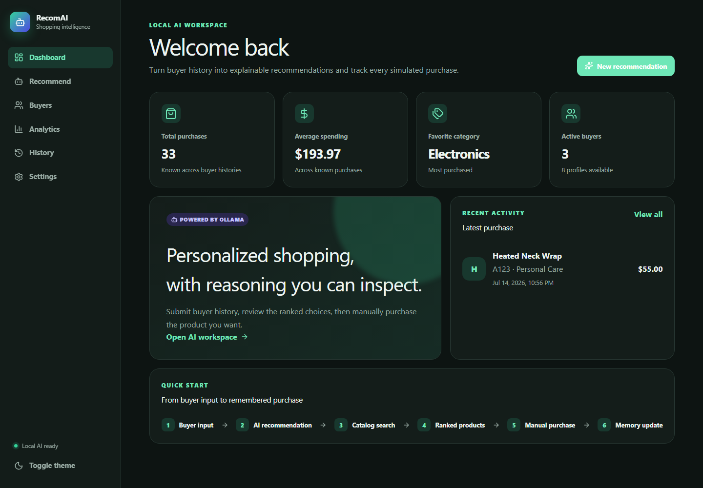
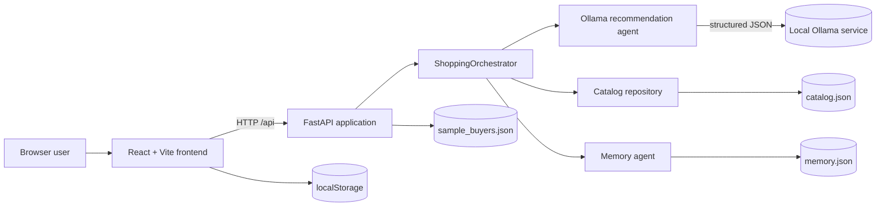
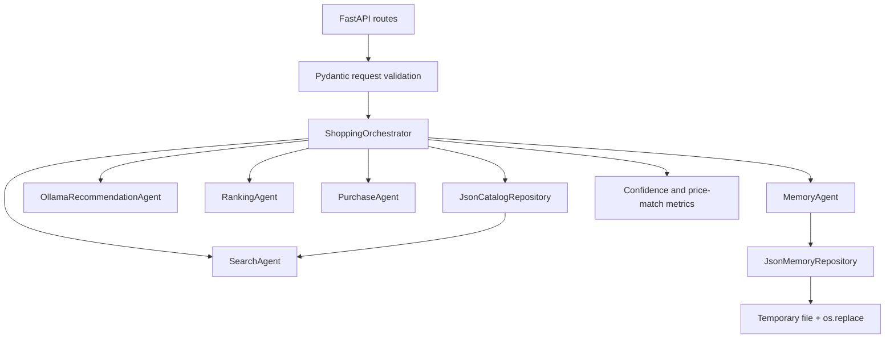
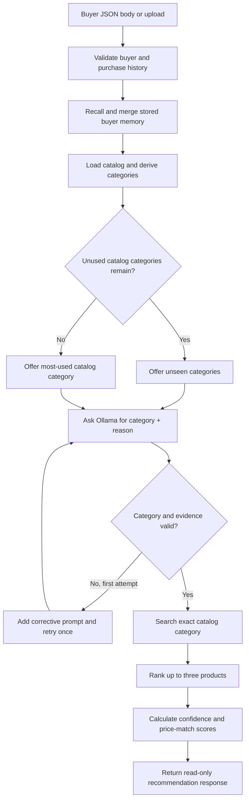
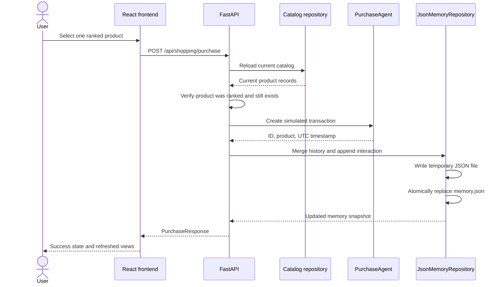
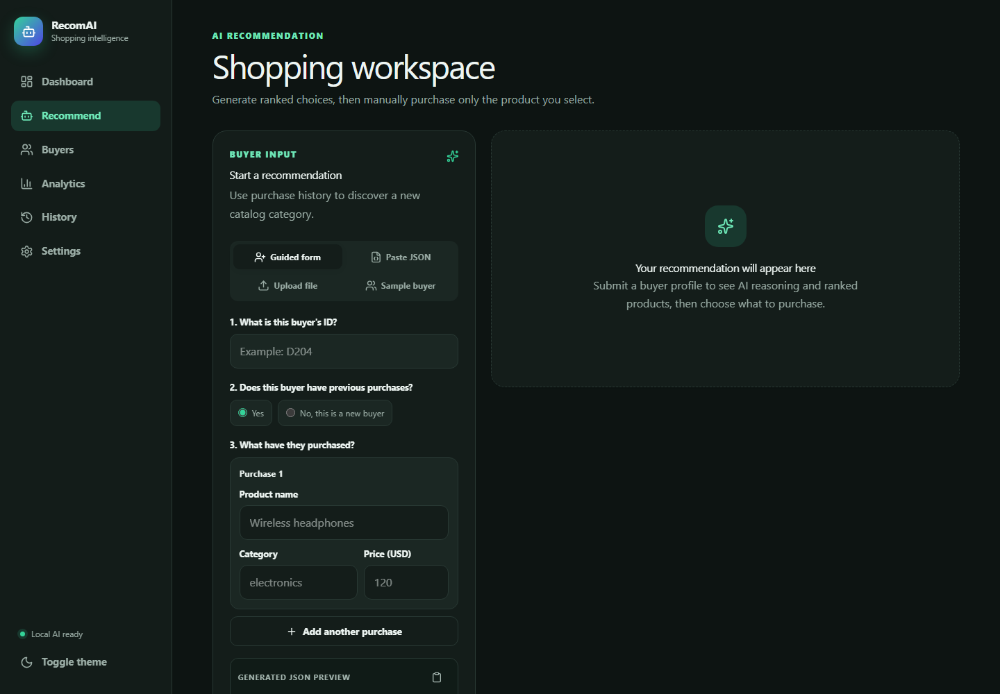
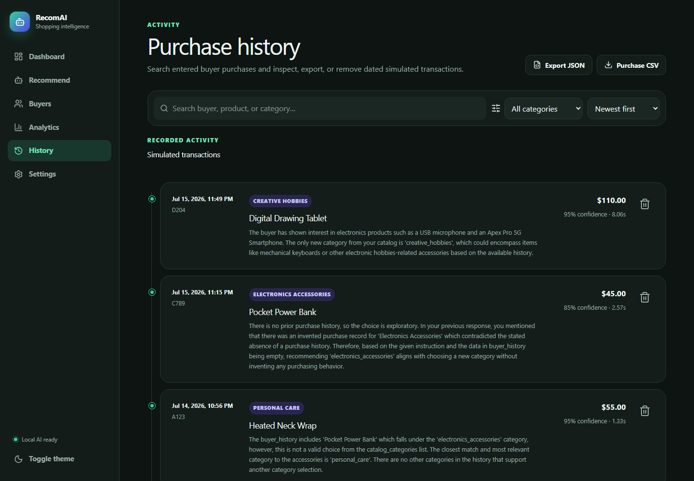
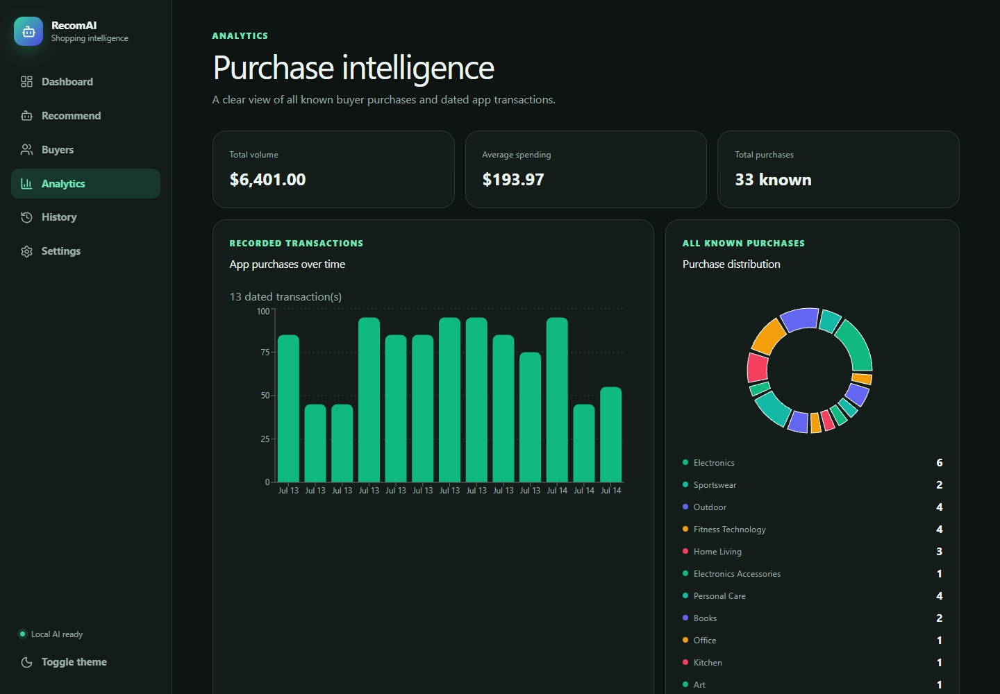

# RecomAI

**A local, explainable AI shopping assistant with structured recommendations, deterministic catalog ranking, and persistent buyer memory.**

RecomAI accepts a buyer profile, recalls prior purchases, asks a local Ollama model to recommend an eligible product category, and ranks matching catalog items by the buyer's historical spending. The user reviews the reasoning and explicitly selects a simulated purchase; only then does the application update its local transaction history and buyer memory.



## Table of contents

- [Project objective](#project-objective)
- [Solution overview](#solution-overview)
- [Key features](#key-features)
- [System architecture](#system-architecture)
- [Agent workflow](#agent-workflow)
- [Technology stack](#technology-stack)
- [Screenshots](#screenshots)
- [Installation](#installation)
- [Configuration](#configuration)
- [API reference](#api-reference)
- [Project structure](#project-structure)
- [Engineering decisions](#engineering-decisions)
- [Improvements beyond the initial objectives](#improvements-beyond-the-initial-objectives)
- [Testing](#testing)
- [Scope and limitations](#scope-and-limitations)

## Project objective

The project was designed to demonstrate a modular AI agent that can act as a personalized shopping assistant. Its original functional objectives were:

1. Accept a buyer profile containing a user ID and purchase history.
2. Use an LLM to analyze that history, choose a product category, and explain the choice.
3. Search a local catalog for the top three matching products and rank them using the buyer's prices or inferred preferences.
4. Simulate a purchase, return a success result, and record the transaction.
5. Retain updated buyer history so later recommendations can use previous interactions.

RecomAI implements those objectives as a local full-stack application. The LLM is responsible only for category selection and natural-language reasoning; catalog search, ranking, purchase validation, and persistence remain deterministic application logic.

## Solution overview

The system has four primary boundaries:

- **React frontend** — provides guided, pasted, uploaded, and sample-profile inputs; renders model reasoning and ranked products; and exposes buyer, history, analytics, and settings views.
- **FastAPI backend** — validates all request data with Pydantic, exposes the application API, maps domain failures to HTTP responses, and coordinates recommendation and purchase operations.
- **Agent pipeline** — recalls memory, constrains the model to eligible catalog categories, validates its structured output, searches the catalog, ranks products, and calculates engineering metrics.
- **Local persistence** — stores catalog, sample, and completed-purchase data in JSON. Browser-created guided profiles and UI preferences use `localStorage`.

RecomAI does not use an autonomous planner or allow the model to call arbitrary tools. `ShoppingOrchestrator` defines a fixed execution plan, while focused agents perform recommendation, search, ranking, purchase, and memory responsibilities.

## Key features

### Core functionality

- Buyer profiles represented as validated JSON with `user_id` and purchase history
- Local Ollama analysis with a structured `category` and natural-language `reason`
- New-category selection while unused catalog categories remain available
- Evidence checks that require reasoning to reference the selected category and actual buyer history
- One corrective retry when the model returns an invalid category or unsupported explanation
- Local catalog search followed by deterministic top-three product ranking
- Ranking by distance from the buyer's historical mean price, then price and product ID
- Explicit manual purchase step separated from recommendation generation
- Simulated transaction IDs, UTC timestamps, and persistent buyer interaction history
- Memory recall that merges stored purchases without duplicating submitted history

### Additional enhancements

- Four input modes: guided form with catalog-backed category dropdowns, pasted JSON, JSON upload, and sample/saved buyer selection
- Six lazy-loaded application views: Dashboard, Recommend, Buyers, Analytics, History, and Settings
- Post-analysis card showing the exact recalled products, categories, and prices used by the workflow
- Product comparison with images, features, prices, and match scores
- Engineering confidence, model timing, warnings, and per-product price-match metrics
- Buyer summaries, browser-local pins, search, category statistics, and spending averages
- Searchable history with JSON/CSV exports and interaction deletion
- Memory reconstruction after deleting an interaction
- Responsive light, dark, and system themes with reduced-motion support
- Atomic JSON replacement and per-memory-file in-process locking
- Centralized domain errors and clear frontend recovery states
- Prerequisite-aware root launcher and automated backend/frontend test suites

## System architecture

### Overall architecture



The frontend and backend are separate development processes. Vite proxies `/api` requests to FastAPI on port `8000`; FastAPI communicates with Ollama through its local HTTP API and reads the configured JSON data directory.

### Backend architecture



The route layer handles HTTP concerns, Pydantic models define data contracts, and the orchestrator owns sequencing. The recommendation agent is represented by a protocol, allowing tests to inject deterministic agents without contacting Ollama.

## Agent workflow

### Recommendation lifecycle



Recommendation generation never writes memory. If both model attempts fail validation, the backend returns `502`; if Ollama cannot be reached or cannot run the selected model, it returns `503`.

### Purchase and memory sequence



## Technology stack

| Area | Technology | Role |
| --- | --- | --- |
| Frontend | React 19 | Component-based user interface and shared application state |
| Routing | React Router 7 | Six lazy-loaded client routes |
| Build tooling | Vite 6 | Development server, API proxy, production build, and test configuration |
| Styling | Tailwind CSS 4 plugin plus project CSS | Responsive layout, themes, and component presentation |
| Visualization | Recharts | Spending timeline and category distribution charts |
| Interaction | Framer Motion, Sonner, Lucide React | Motion, notifications, and icons |
| Backend | Python, FastAPI, Uvicorn | HTTP API and local application server |
| Validation | Pydantic | Buyer, recommendation, product, metrics, purchase, and memory contracts |
| LLM runtime | Ollama | Local structured category recommendation and reasoning |
| Persistence | JSON, `tempfile`, `os.replace`, `threading.RLock` | Local catalog/sample data and atomic buyer-memory updates |
| Backend testing | pytest, FastAPI TestClient, HTTPX | Workflow, validation, failure, and persistence coverage |
| Frontend testing | Vitest, Testing Library, jsdom | Routed UI, input, purchase, persistence, and error-state coverage |

The repository does not declare minimum Python or Node.js versions. Use maintained releases compatible with the dependency ranges in `backend/requirements.txt` and `frontend/package.json`.

## Screenshots

### Dashboard

The dashboard summarizes known purchases, spending, active buyers, latest activity, and the application workflow.


### Recommendation workspace

The recommendation view supports guided buyer construction, pasted JSON, file uploads, and sample or browser-saved profiles. After analysis it also displays the exact recalled purchase history used by the agent.



### Purchase history

The history view provides searchable and filterable access to simulated transactions and entered buyer purchases. Recorded transactions can be sorted, exported as JSON or CSV, or removed from persistent memory.



### Analytics

Analytics combines all known buyer purchases for aggregate metrics and category distribution, while recorded application transactions provide the dated spending chart.



## Installation

### Prerequisites

- Python with `pip`
- Node.js with `npm`
- [Ollama](https://ollama.com/) with its CLI available on `PATH`

### Clone and install

```bash
git clone https://github.com/jassermedhat/RecomAI.git
cd RecomAI

ollama pull qwen2.5:3b
python -m pip install -r backend/requirements.txt

cd frontend
npm install
cd ..
```

### Verify prerequisites

```bash
python run.py --check
```

The check verifies the backend packages, frontend dependencies, Ollama CLI, and configured model without starting the application.

### Run the complete local stack

```bash
python run.py
```

The launcher starts:

- Ollama on `127.0.0.1:11434` if that port is not already serving a process
- FastAPI on `http://127.0.0.1:8000`
- Vite on `http://127.0.0.1:5173`

Open `http://127.0.0.1:5173`. Press `Ctrl+C` in the launcher terminal to stop the frontend and backend; the launcher stops Ollama only when it started that process.

### Run services manually

Start Ollama separately, then use two terminals:

```bash
# Terminal 1
cd backend
python -m uvicorn app.main:app --reload --host 127.0.0.1 --port 8000
```

```bash
# Terminal 2
cd frontend
npm run dev
```

Manual startup is the appropriate option when using a custom `OLLAMA_URL`. No Dockerfile or Docker Compose configuration is included.

## Configuration

Configuration is read directly from the process environment. The application has no dotenv loader and requires no secrets.

| Variable | Default | Description |
| --- | --- | --- |
| `DATA_DIR` | `backend/data` | Directory containing `catalog.json`, `sample_buyers.json`, and `memory.json` |
| `OLLAMA_URL` | `http://127.0.0.1:11434` | Ollama base URL used for model readiness and chat requests |
| `OLLAMA_MODEL` | `qwen2.5:3b` | Model used by the backend and checked by the root launcher |
| `MAX_UPLOAD_BYTES` | `1000000` | Maximum accepted buyer-profile upload size in bytes |

Example for PowerShell:

```powershell
$env:OLLAMA_MODEL = "qwen2.5:3b"
$env:MAX_UPLOAD_BYTES = "2000000"
python run.py
```

Example for Bash:

```bash
export OLLAMA_MODEL="qwen2.5:3b"
export MAX_UPLOAD_BYTES="2000000"
python run.py
```

The root launcher manages Ollama only on the default local port `11434`. When `OLLAMA_URL` points elsewhere, start the services manually.

## API reference

FastAPI serves the API at `http://127.0.0.1:8000`. Interactive OpenAPI documentation is available at `http://127.0.0.1:8000/docs` while the backend is running. During frontend development, Vite proxies the same paths from port `5173`.

### Buyer profile schema

```json
{
  "user_id": "A123",
  "history": [
    {
      "product": "Bluetooth headphones",
      "category": "electronics",
      "price": 120
    },
    {
      "product": "Running shoes",
      "category": "sportswear",
      "price": 80
    }
  ]
}
```

`user_id`, product names, and categories must be non-blank. Prices must be finite and non-negative.

### Endpoint summary

| Method | Path | Purpose |
| --- | --- | --- |
| `GET` | `/api/sample-buyers` | Return sample profiles with persisted purchases recalled |
| `GET` | `/api/catalog/categories` | Return the current catalog's distinct categories |
| `GET` | `/api/buyers` | Return merged sample and stored buyer summaries |
| `GET` | `/api/history` | Return recorded recommendation/purchase interactions |
| `GET` | `/api/system-info` | Return application, model, readiness, and memory information |
| `POST` | `/api/shopping/process` | Generate a recommendation from a buyer JSON body |
| `POST` | `/api/shopping/upload` | Generate a recommendation from an uploaded JSON profile |
| `POST` | `/api/shopping/purchase` | Purchase one product from the current ranked context |
| `DELETE` | `/api/history/{user_id}/{transaction_id}` | Delete one interaction and rebuild the latest memory snapshot |

<details>
<summary><code>GET /api/sample-buyers</code></summary>

**Purpose:** Load the profiles in `sample_buyers.json` and merge each with matching persisted purchases.

**Request:** No body.

**Response:** `200 OK` with an array of buyer profiles.

```bash
curl http://127.0.0.1:8000/api/sample-buyers
```

```json
[
  {
    "user_id": "C789",
    "history": []
  }
]
```

**Notes:** Stored history is recalled without duplicating an already-submitted prefix.

</details>

<details>
<summary><code>GET /api/catalog/categories</code></summary>

**Purpose:** Return the category choices currently available in `catalog.json`.

**Request:** No body.

**Response:** `200 OK` with a case-insensitively sorted array of distinct category identifiers.

```bash
curl http://127.0.0.1:8000/api/catalog/categories
```

```json
[
  "creative_hobbies",
  "electronics",
  "electronics_accessories",
  "fitness_technology",
  "home_living",
  "kitchen_technology",
  "outdoor",
  "personal_care",
  "smart_home",
  "travel_essentials"
]
```

**Notes:** The guided form uses this endpoint for every purchase category dropdown; the values are not duplicated in frontend source code.

</details>

<details>
<summary><code>GET /api/buyers</code></summary>

**Purpose:** Build summaries for all sample and backend-memory buyers.

**Request:** No body.

**Response:** `200 OK` with purchase counts, interaction counts, average spending, favorite category, and sample status.

```bash
curl http://127.0.0.1:8000/api/buyers
```

```json
[
  {
    "user_id": "C789",
    "purchase_history": [],
    "purchase_count": 0,
    "interaction_count": 0,
    "average_spending": 0,
    "favorite_category": null,
    "is_sample": true
  }
]
```

**Notes:** Guided profiles stored only in the current browser are merged by the frontend and are not returned by this backend endpoint until a simulated purchase is completed.

</details>

<details>
<summary><code>GET /api/history</code></summary>

**Purpose:** Return persisted recommendation/purchase interactions, newest first.

**Request:** No body.

**Response:** `200 OK` with recommendation, ranked products, purchased product, transaction, and optional metrics for each record.

```bash
curl http://127.0.0.1:8000/api/history
```

```json
[
  {
    "user_id": "A123",
    "recommendation": {
      "category": "outdoor",
      "reason": "The buyer history supports the outdoor category."
    },
    "ranked_products": [],
    "purchased_product": {
      "product": "Compact Camp Stove",
      "category": "outdoor",
      "price": 85.0,
      "product_id": "OD-302",
      "features": []
    },
    "transaction": {
      "transaction_id": "SIM-123456789ABC",
      "user_id": "A123",
      "product": {
        "product": "Compact Camp Stove",
        "category": "outdoor",
        "price": 85.0,
        "product_id": "OD-302",
        "features": []
      },
      "status": "simulated_success",
      "purchased_at": "2026-07-15T10:00:00Z"
    },
    "recommendation_metrics": null
  }
]
```

**Notes:** Browser-only entered history is displayed separately by the frontend because it has no transaction ID or purchase timestamp.

</details>

<details>
<summary><code>GET /api/system-info</code></summary>

**Purpose:** Report the application version, configured model, Ollama readiness, and memory location.

**Request:** No body.

**Response:** `200 OK`.

```bash
curl http://127.0.0.1:8000/api/system-info
```

```json
{
  "version": "2.0.0",
  "ollama_model": "qwen2.5:3b",
  "ollama_ready": true,
  "memory_type": "Local JSON memory",
  "memory_location": "C:\\path\\to\\RecomAI\\backend\\data\\memory.json"
}
```

**Notes:** Readiness is true only when the configured model appears in Ollama's local model list. The memory location is returned as the resolved path for the active data directory.

</details>

<details>
<summary><code>POST /api/shopping/process</code></summary>

**Purpose:** Validate a buyer, recall memory, request and validate an LLM category, search the catalog, and return ranked products.

**Request:** `application/json` buyer profile.

```bash
curl -X POST http://127.0.0.1:8000/api/shopping/process \
  -H "Content-Type: application/json" \
  -d '{"user_id":"A123","history":[{"product":"Bluetooth headphones","category":"electronics","price":120}]}'
```

**Response:** `200 OK` with `message`, recalled `buyer`, `recommendation`, up to three `ranked_products`, `recommendation_metrics`, and `warnings`.

| Response field | Type | Description |
| --- | --- | --- |
| `message` | string | Readiness message; prompts the user to choose a product |
| `buyer` | object | Submitted profile after backend-memory recall and merge |
| `recommendation` | object | Validated category and model-generated reason |
| `ranked_products` | array | At most three current catalog products in deterministic rank order |
| `recommendation_metrics` | object | Confidence, generation time, model duration, match scores, and score explanation |
| `warnings` | array | Includes a warning when fewer than three matches exist |

**Notes:** This endpoint is read-only. It does not create a transaction or update memory.

</details>

<details>
<summary><code>POST /api/shopping/upload</code></summary>

**Purpose:** Run the same recommendation workflow using a JSON file upload.

**Request:** `multipart/form-data` with a `.json` file in the `file` field.

```bash
curl -X POST http://127.0.0.1:8000/api/shopping/upload \
  -F "file=@buyer.json;type=application/json"
```

**Response:** The same `RecommendationResponse` returned by `/api/shopping/process`.

**Notes:** Files are read up to `MAX_UPLOAD_BYTES + 1`; oversized files return `413`, and invalid filenames, encoding, JSON, or buyer data return `422`.

</details>

<details>
<summary><code>POST /api/shopping/purchase</code></summary>

**Purpose:** Complete one simulated purchase from a previously returned ranked recommendation.

**Request:** `application/json` containing the recalled `buyer`, `recommendation`, `ranked_products`, `recommendation_metrics`, and selected `product_id`.

```json
{
  "buyer": {
    "user_id": "A123",
    "history": [
      {
        "product": "Bluetooth headphones",
        "category": "electronics",
        "price": 120.0
      }
    ]
  },
  "recommendation": {
    "category": "home_living",
    "reason": "Bluetooth headphones in the buyer history provide a technology signal for the home_living category."
  },
  "ranked_products": [
    {
      "product": "Weighted Throw Blanket",
      "category": "home_living",
      "price": 75.0,
      "product_id": "HC-402",
      "features": ["Breathable weave", "Even weight", "Machine washable"]
    }
  ],
  "recommendation_metrics": {
    "confidence": 95,
    "generated_at": "2026-07-15T10:00:00Z",
    "thinking_duration_ms": 900,
    "product_match_scores": {
      "HC-402": 90
    },
    "confidence_basis": "Engineering score based on category novelty, buyer-history signal, and catalog match availability."
  },
  "product_id": "HC-402"
}
```

```bash
curl -X POST http://127.0.0.1:8000/api/shopping/purchase \
  -H "Content-Type: application/json" \
  --data @purchase.json
```

**Response:** `200 OK` with a success `message`, `selected_product`, simulated `purchase`, and updated `memory` snapshot.

**Notes:** The selected ID must be present in the submitted ranked products and in the current catalog. The endpoint reloads the catalog before purchase and writes memory only after both checks pass.

</details>

<details>
<summary><code>DELETE /api/history/{user_id}/{transaction_id}</code></summary>

**Purpose:** Delete one stored interaction.

**Request:** Buyer and transaction IDs in the URL path.

```bash
curl -X DELETE http://127.0.0.1:8000/api/history/A123/SIM-123456789ABC
```

**Response:** `204 No Content` when deleted.

**Notes:** Remaining memory is rebuilt from the latest interaction. Deleting the buyer's final interaction removes that buyer from backend memory. A missing interaction returns `404`.

</details>

### Error responses

| Status | Meaning |
| --- | --- |
| `404` | No products matched, or the requested history interaction does not exist |
| `413` | Uploaded buyer JSON exceeds `MAX_UPLOAD_BYTES` |
| `422` | Buyer data, upload contents, or purchase selection is invalid |
| `500` | Required JSON storage is missing, corrupt, invalid, or cannot be updated |
| `502` | Ollama returned invalid recommendation output after the corrective retry |
| `503` | Ollama is unavailable or cannot run the configured model |

## Project structure

```text
.
├── backend/
│   ├── app/
│   │   ├── agents.py          Recommendation, search, ranking, and purchase agents
│   │   ├── config.py          Environment-backed runtime settings
│   │   ├── errors.py          Application-specific error hierarchy
│   │   ├── main.py            FastAPI application and route registration
│   │   ├── models.py          Pydantic request, response, and memory models
│   │   ├── orchestrator.py    Recommendation and purchase execution pipeline
│   │   └── storage.py         Catalog and atomic JSON memory repositories
│   ├── data/
│   │   ├── catalog.json       30 products across 10 catalog categories
│   │   ├── memory.json        Mutable completed-purchase memory
│   │   └── sample_buyers.json Eight starter buyer profiles
│   ├── tests/
│   │   └── test_workflow.py   Backend workflow and failure-path tests
│   └── requirements.txt
├── frontend/
│   ├── public/products/       Product artwork keyed by catalog product ID
│   ├── src/
│   │   ├── components/        Input, result, shell, and shared UI components
│   │   ├── context/           API data, browser persistence, pins, and themes
│   │   ├── pages/             Dashboard, Recommend, Buyers, Analytics, History, Settings
│   │   ├── api.js             Frontend API client
│   │   ├── App.jsx            Lazy route registration
│   │   └── App.test.jsx       Frontend integration-style component tests
│   ├── package.json
│   └── vite.config.js
├── docs/screenshots/          README screenshots
├── run.py                     Prerequisite checker and local process launcher
└── README.md
```

## Engineering decisions

### Constrain the LLM to semantic work

Ollama analyzes history and produces one category plus a reason. Application code supplies the allowed category enum, rejects repeated or nonexistent categories, checks that the explanation cites real history, and retries once. Search, ranking, transactions, and persistence never depend on free-form model instructions.

### Keep planning deterministic

`ShoppingOrchestrator` is a fixed execution pipeline rather than an open-ended planner. This makes every side effect explicit: recommendation is read-only, while purchase is a separate operation with catalog revalidation and a single memory update.

### Separate focused agents and repositories

Recommendation, search, ranking, purchase, and memory behavior are isolated behind small classes. The recommendation protocol supports deterministic test doubles, while repositories keep JSON validation and write mechanics out of route handlers.

### Use FastAPI and Pydantic at the boundary

FastAPI supplies route composition and interactive OpenAPI documentation. Pydantic enforces non-blank identifiers, bounded text, finite non-negative prices, typed products, structured metrics, and purchase context before orchestration begins.

### Use local Ollama and JSON persistence

Ollama keeps model execution on the local machine. JSON keeps the demonstration inspectable and requires no database service; temporary-file replacement and an in-process re-entrant lock reduce the risk of partial writes within the supported single-process runtime.

### Keep frontend state responsibilities explicit

Backend memory is authoritative for completed simulated transactions. Browser `localStorage` retains guided profiles, pins, and theme preferences. The UI distinguishes undated entered history from dated backend interactions instead of inventing transaction metadata.

## Improvements beyond the initial objectives

| Initial objective | Implemented foundation | Additional engineering |
| --- | --- | --- |
| Accept buyer JSON | Typed `BuyerProfile` body | Guided form with live catalog categories, JSON preview/copy, paste mode, upload limits, samples, browser-saved profiles |
| Generate an LLM recommendation | Local category and reason | Structured JSON schema, eligible-category enum, evidence validation, contradiction checks, empty-history safeguards, corrective retry |
| Find and rank three products | Exact category search and mean-price ranking | Stable tie-breaking, match percentages, warnings for short result sets, product comparison and artwork |
| Simulate a purchase | Product selection and success response | Explicit user confirmation, ranked-context validation, current-catalog revalidation, UUID transaction IDs, UTC timestamps |
| Remember interactions | JSON buyer memory | History recall/merge, duplicate avoidance, interaction arrays, atomic replacement, locking, deletion and snapshot reconstruction |
| Present a usable result | Recommendation response | Six-page responsive interface, dashboard KPIs, analytics, history filters, exports, themes, readiness and failure states |
| Demonstrate reliability | Functional workflow | 19 backend tests, 13 frontend tests, deterministic agent doubles, prerequisite checker, production build validation |

## Testing

From the repository root:

```bash
python -m pytest -q backend
```

The backend suite covers recommendation/purchase separation, memory recall, validation, uploads, catalog data, Ollama failures, ranking, structured-output retry, empty-history reasoning, storage corruption, read endpoints, deletion, and purchase revalidation.

```bash
cd frontend
npm run test
npm run build
```

The frontend suite covers routing, dashboard and analytics data, browser-storage recovery, Ollama status, manual purchase behavior, recalled-history presentation, guided JSON construction, saved-buyer persistence, duplicate IDs, progress states, errors, and themes.

Backend workflow tests replace Ollama with deterministic agents. The repository does not currently configure linting, static type checking, CI workflows, or browser end-to-end automation.

## Scope

- RecomAI is intended for local development, demonstration, and engineering review.
- Purchases are simulated; there is no payment processing, checkout provider, or inventory mutation.
- The interface is a responsive web application.
- Ollama is the only external runtime integration.
- JSON memory is designed for a single backend process, not concurrent multi-worker or distributed deployment.
- Guided profiles remain in the same browser unless a completed simulated purchase writes them to backend memory; clearing browser storage removes browser-only profiles and preferences.
- The engineering confidence score is deterministic application metadata, not an LLM probability or calibrated statistical confidence.
